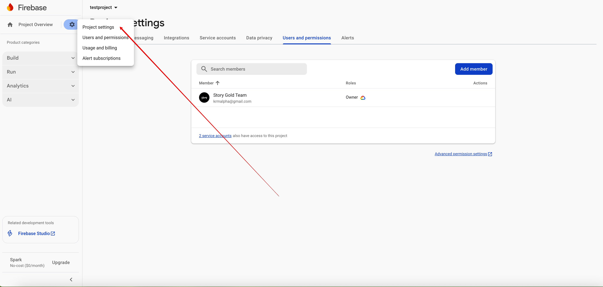
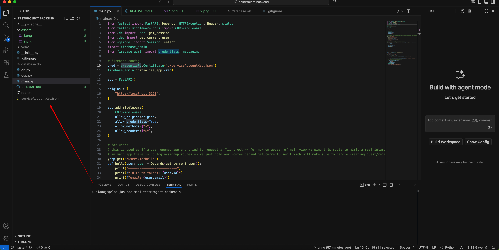

## Clone
```bash
git clone https://github.com/Orino1/flight-tracker-test.git
```
## Prepare virtual environment
```
cd flight-tracker-test

pyton3 -m venv venv

source venv/bin/activate
```
## Install dependencies
```
pip install -r req.txt
```
## Prepare firebase credentials
```bash
1. go to firebase console → project settings → service accounts   
2. upon downloading the generated key xxxxxxxxxxxxxxxxx.json rename it into "serviceAccountKey.json"  
3. move it to the root of this project
```
## Run server
```bash
fastapi dev main.py
```